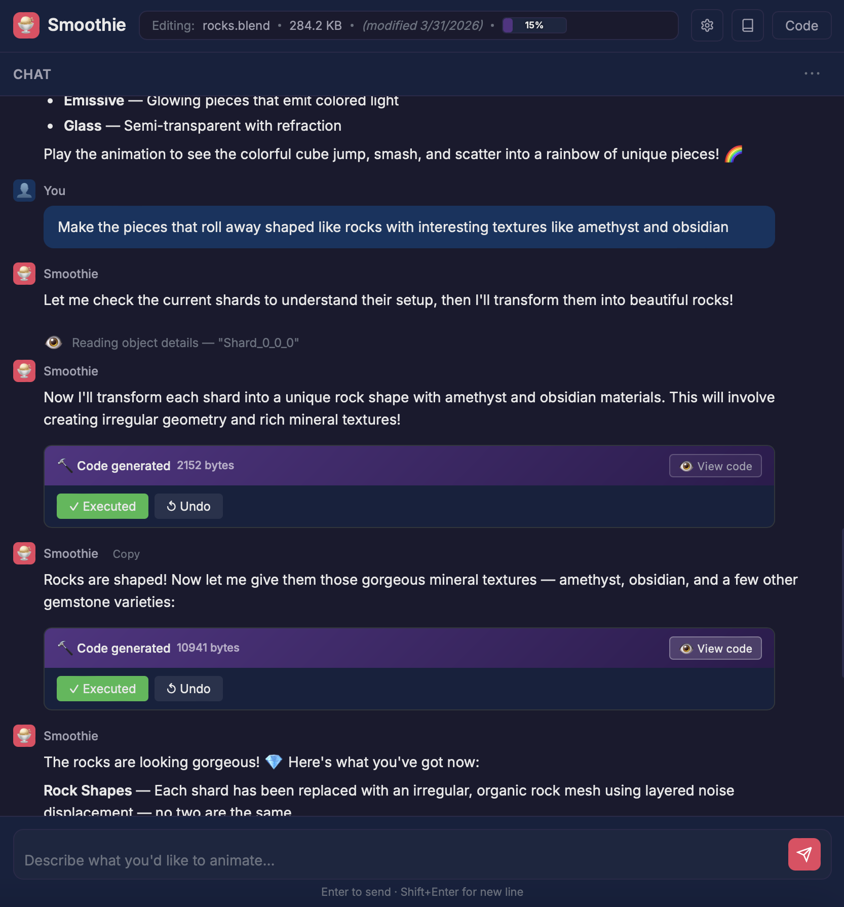
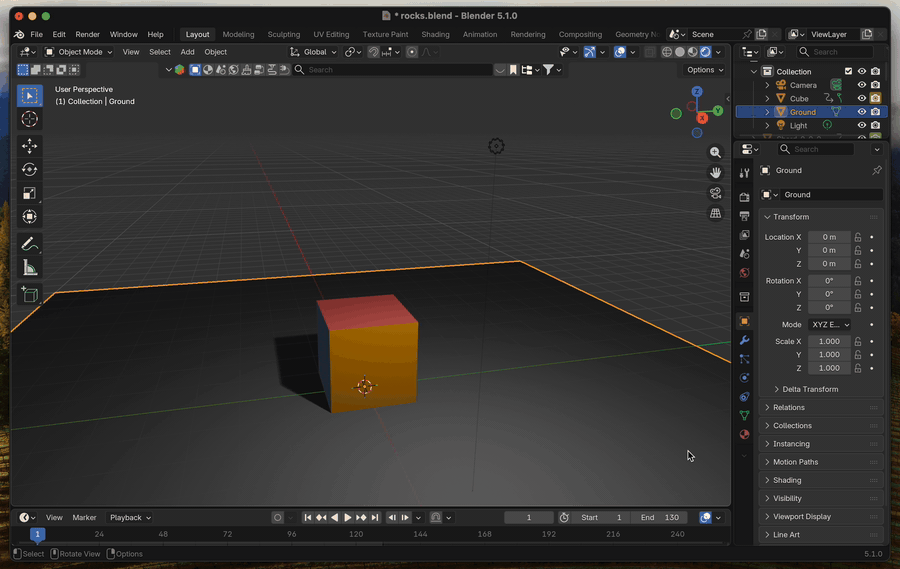

# Smoothie

**AI-powered animation for Blender using natural language.**

*Free software released under the [GNU General Public License v3.0 or later](LICENSE).*

Smoothie is a Blender add-on that lets you create animations by describing what you want in plain English. Type a prompt like *"make the cube bounce across the scene"* and Smoothie generates the Python code, shows it to you for review, and executes it in Blender with a single click.

<table>
  <tr>
    <td width="50%"></td>
    <td width="50%"></td>
  </tr>
</table>

## How It Works

1. Open the Smoothie chat in your browser from Blender's sidebar
2. Describe the animation you want in natural language
3. Review the generated code — click **Execute** to apply or **Reject** to send feedback
4. The AI sees the result and can iterate — fixing errors, responding to feedback, or building on what it created

Smoothie uses the [Claude Agent SDK](https://docs.anthropic.com/en/docs/agents-and-tools/claude-agent-sdk) for AI inference, with a full suite of tools for exploring your scene, managing reusable code libraries, and importing assets.

## Features

- **Natural language animation**: Describe what you want, get working `bpy` code
- **Agentic workflow**: The AI reads your scene, generates code, handles errors, and iterates based on your feedback — all in a multi-turn conversation
- **Scene exploration tools**: The AI can inspect objects, materials, animations, hierarchy, render settings, and more
- **Persistent sessions**: Conversations persist across Blender restarts via the SDK's session system
- **Reusable code library**: Build up Python functions that persist in the project and are available across all code executions
- **Project notes**: Maintain a `smoothie.md` file with project goals and structure that the AI uses as context
- **Asset integration**: Import assets from Blender's Asset Browser or BlenderKit (if installed)
- **Auto-execute mode**: Optionally run generated code automatically without manual approval
- **Sandboxed execution**: AST validation blocks dangerous imports; every execution has undo support
- **Settings persistence**: Model choice, auth mode, and preferences persist across sessions
- **Chat export**: Download conversations as markdown + JSONL archives, or print/save as PDF with a styled print view

## Sample Project

The `sample_project/` folder contains a worked example showing what Smoothie can produce:

- **`space_battle.mp4`** — a short animated space battle scene rendered in Blender, built from scratch through a natural-language conversation with Smoothie.
- **`space_battle_chat.pdf`** — the full printed transcript of the Smoothie chat session that produced the video, including every prompt, every code generation block, and the iterative back-and-forth.

Read the chat transcript alongside the video to see how an end-to-end Smoothie workflow actually unfolds — from initial description through scene exploration, code generation, refinement, and final render.

## Interface

The browser-based UI (served at `localhost:8888`) has:

- **Chat pane** — conversation with the AI, including tool activity indicators, code generation blocks with Execute/Reject controls, and a `...` menu for Clear Chat, Download Chat, and Print Chat
- **Code pane** (toggleable) — syntax-highlighted code viewer with line numbers
- **Developer pane** (toggleable) — stream events, tool calls, and token usage for debugging
- **Library modal** — manage reusable Python files and project notes
- **Settings** — authentication, model selection, auto-execute toggle

## Requirements

- **Blender 5.1+**
- **Python 3.10+** installed on your system (separate from Blender's embedded Python)
- **Claude Code CLI** installed and logged in, *or* an Anthropic API key
- **BlenderKit** (optional) — for searching and importing assets from the BlenderKit catalog

## Installation

### 1. Set up the Python environment

Smoothie's AI backend runs in a sidecar process using your system Python. Create a virtual environment in the project root:

```bash
cd /path/to/smoothie
python3 -m venv .venv
.venv/bin/pip install claude-agent-sdk
```

### 2. Install the Claude Code CLI (for subscription auth)

```bash
npm install -g @anthropic-ai/claude-code
```

Skip this if you plan to use an API key instead.

### 3. Install the add-on in Blender

Symlink the `smoothie/` package directory into Blender's add-ons folder:

```bash
# macOS
ln -s /path/to/smoothie/smoothie \
  ~/Library/Application\ Support/Blender/5.1/scripts/addons/smoothie

# Linux
ln -s /path/to/smoothie/smoothie \
  ~/.config/blender/5.1/scripts/addons/smoothie
```

Then in Blender: **Edit > Preferences > Add-ons** — search for "Smoothie" and enable it.

## Usage

1. In the 3D Viewport, press **N** to open the sidebar and find the **Smoothie** tab
2. Click **Open Chat in Browser** — your browser opens `localhost:8888`
3. (Optional) Click **Settings** to choose authentication mode and model
4. Start chatting! Try things like:
   - *"Create a red sphere and make it bounce"*
   - *"Add a camera that orbits around the scene"*
   - *"Search BlenderKit for a robot model and add it to the scene"*
   - *"Create a library function for applying gravity to objects"*

## Architecture

Smoothie runs as three cooperating processes:

| Process | Role |
|---------|------|
| **Blender** | Executes `bpy` code on the main thread; exposes an internal HTTP API on port 8889 for scene queries, code execution, library files, and asset operations |
| **Sidecar** | System Python process running Starlette/uvicorn on port 8888; serves the UI, manages the AI conversation, proxies commands to Blender |
| **Claude CLI** | Spawned by the Agent SDK inside the sidecar; handles AI inference |

The sidecar architecture exists because the Claude Agent SDK has native dependencies that can't run inside Blender's embedded Python. The sidecar launcher automatically finds a suitable system Python with the SDK installed.

## Safety

- Generated code is validated via AST analysis before execution — dangerous imports (`os`, `subprocess`, `shutil`, etc.) are blocked and will raise `ImportError`
- Every execution is wrapped in an undo step so you can always revert
- Code is shown for review before execution (auto-execute is off by default)
- The AI sees execution results and rejection feedback, enabling iterative refinement

## Project Structure

```
smoothie/
  __init__.py           # Add-on registration and preferences
  sidecar_launcher.py   # Finds system Python and launches the sidecar
  sidecar/              # AI backend + web UI server
  blender_api/          # Internal HTTP API for code execution and scene queries
  executor/             # Sandboxed code runner with persistent namespace and undo
  ai/                   # Scene context queries and system prompt
  ui/                   # Blender sidebar panel and operators
sample_project/         # Example video + chat transcript showing Smoothie in action
tests/
  scripts/              # Unit tests and integration test framework
```

## License

Smoothie is free software, released under the [GNU General Public License v3.0 or later](LICENSE) — the same copyleft license as Blender itself. This matches the [Blender Foundation's guidance](https://www.blender.org/about/license/) that Python add-ons using `bpy` are considered derivative works of Blender and should be distributed under a GPL-compatible license.

You are free to use, modify, and redistribute Smoothie, including for commercial purposes, provided that any derivative work you distribute is also released under the GPL. See the [`LICENSE`](LICENSE) file for the full license text.
